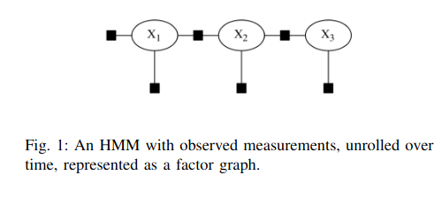
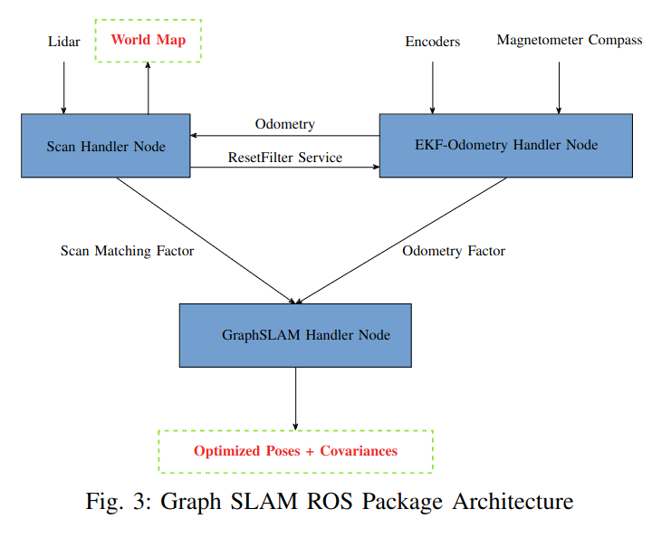
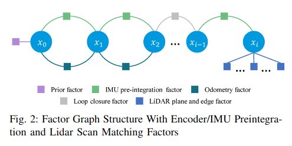
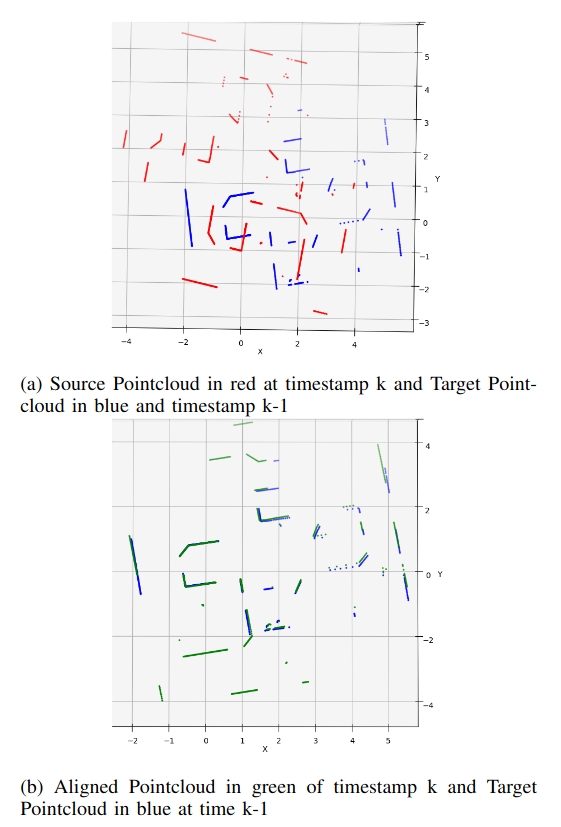
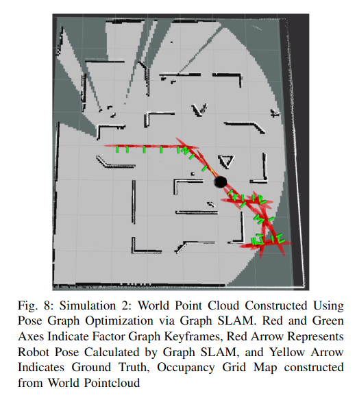
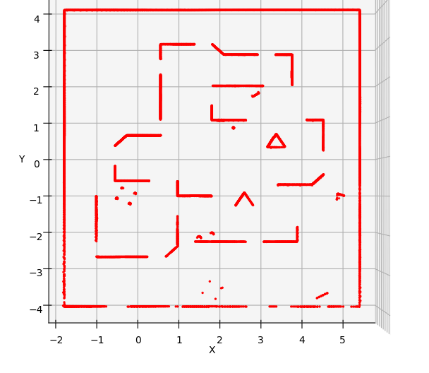
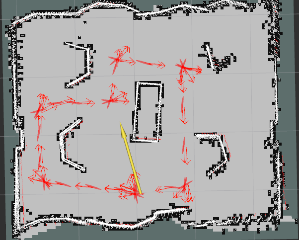

# turtlebot_graph_slam

This ROS package implements SLAM (Simultaneous Localization and Mapping) using Pose Graph Optimization with the help of Factor Graphs from GTSAM library for the Turtlebot2 robot.The package was designed in [stonefish](https://github.com/patrykcieslak/stonefish) simulator using [Turtlebot2](https://bitbucket.org/udg_cirs/turtlebot_simulation/src/master/) Simulation Packages. The package was tested on ROS Noetic running on Ubuntu 20.04 Machine.

## Overview
Simultaneous Localization and Mapping (SLAM) is a critical challenge in robotics, where a robot concurrently builds or updates a map of an unknown environment and tracks its position within that environment. This work aims to implement a robust Simultaneous Localization and Mapping algorithm on a turtlebot platform using onboard sensors - 2D Lidar, Wheel Encoders, and Magnetometer compass. This study explores the implementation of online SLAM and full SLAM using factor graphs, specifically leveraging the Georgia Tech Smoothing and Mapping (GTSAM) library on a Turtlebot robot platform with the Robot Operating System (ROS). We describe the construction of the factor graph for SLAM, incorporating 2D Lidar scans and odometry data, and validate our approach through simulations and experiments in real world. Our study also incorporates the Closed form ICP covariance estimation method proposed in [here](https://ieeexplore.ieee.org/document/7153246). The Graph SLAM output, both with and without the proposed method, was recorded during real-world testing. Additionally, the impact of the keyframe triggering parameter was evaluated.

Factor graphs are a powerful tool for modeling and solving estimation problems. They are used in many applications, including SLAM, sensor fusion, and computer vision. In this project, we use factor graphs to model the SLAM problem. The factor graph consists of nodes and factors. The nodes represent the robot poses and the landmarks in the environment. The factors represent the constraints between the nodes. The constraints are derived from the sensor measurements, such as odometry and laser scans. The goal of the SLAM algorithm is to estimate the robot poses and the landmarks that best explain the sensor measurements.

<div align="center">
    
</div>


## Package Architecture
The turtlebot_graph_slam package has the following architecture:

<div align="center">
    
</div>

The architecture consists of several components:
- **EKF Odometry Node**: This node is responsible for performing the Odometry using Extended Kalman Filter on encoder readings obtained from the wheels.
- **Scan Matching Node**: This node is responsible for registering consecutive laser scans and estimating the robot's odometry using the Iterative Closest Point (ICP) algorithm.
- **Graph SLAM Node**: This node houses the code for adding the Scan registration and Odometry factors to the graph and optimizing using the Levenberg-Marquardt algorithm or the ISAM2 algorithm, depending on the value of the `Use_ISAM2` parameter.
- **Configuration Files**: The package includes several configuration files that define the parameters for the SLAM algorithm, the EKF odometry, the ICP algorithm, and other components.

The package architecture is designed to provide a modular and flexible framework for SLAM on the Turtlebot2 robot. Each component can be customized or replaced to adapt to different requirements or sensor configurations as long as same data is added to the graph.

Following is the Factor Graph Structure for this package:

<div align="center">

</div>


## Dependencies

This package has the following dependencies:

- ROS Noetic
- Stonefish Simulator
- Turtlebot Simulation Packages
- GTSAM Library
- PCL Library
- Eigen Library
- Boost Library


## Installation

To install the turtlebot_graph_slam package, follow these steps:

### Install the dependencies:
1. ROS Noetic: Follow the instructions [here](http://wiki.ros.org/noetic/Installation/Ubuntu).
2. Stonefish Simulator: Follow the instructions [here](https://github.com/patrykcieslak/stonefish)
3. Turtlebot Simulation Packages: Follow the instructions [here](https://bitbucket.org/udg_cirs/turtlebot_simulation/src/master/)
4. GTSAM Library: Follow the instructions [here](https://gtsam.org/build/)
5. PCL Library: Follow the instructions [here](https://pointclouds.org/downloads/)
6. If you don't have Eigen and Boost libraries installed, you can install them using the following commands:
    ```
    $ sudo apt install libeigen3-dev
    $ sudo apt install libboost-all-dev
    ```
### Build the package:

To build the turtlebot_graph_slam package, follow these steps:
1. Clone the repository into your ROS catkin workspace:
    ```
    $ git clone https://github.com/patweatharva/turtlebot_graph_slam.git
    ```

2. Build the package:
    ```
    $ cd ~/catkin_ws
    $ catkin build
    ```
    if you dont have catkin tools installed, you can install it from [here](https://catkin-tools.readthedocs.io/en/latest/installing.html)

3. Source the setup file:
    ```
    $ source devel/setup.bash
    ```
    You can add this line to your `.bashrc` file to run it automatically when you open a new terminal.
    
4. If while building the package can not find the GTSAM library, provide necessary path to the library in CMakeLists.txt file. Same goes for PCL, Eigen and Boost libraries.

## Usage

### IMPORTANT!!
1. Before launching the files change which mode (SIL/HIL) is in use from the [src/config.py](/src/config.py) file and launch respective file using following instructions.

* SIL - Software in Loop when working in Simulator.
* HIL - Hardware in Loop when working on real turtlebot robot.

To use the turtlebot_graph_slam package, follow these steps:

If you are using the stonefish simulator, you can launch the turtlebot_graph_slam package using the following command:
```
$ roslaunch turtlebot_graph_slam env_graph_slam_SIL.launch
```

This file is going to launch `turtlebot_integration.launch` file from turtlebot_simulation package. This file is going to launch the turtlebot in the stonefish simulator. 


If you are using the real turtlebot robot, you can launch the turtlebot_graph_slam package using the following command:

```
$ roslaunch turtlebot_graph_slam env_graph_slam_HIL.launch
```
Once the simulation is running, you can visualize the SLAM output using RViz. The graph SLAM starts optimization process after atleast two keyframes are added thus start moving the robot using the teleop package. You can use the following command to run the teleop node:
```
rosrun teleop_twist_keyboard teleop_twist_keyboard.py
```

If you don't have the teleop_twist_keyboard package installed, you can install it from [here](http://wiki.ros.org/teleop_twist_keyboard)

## Parameters

The turtlebot_graph_slam package provides the following parameters:

- `saveGraph`: If set to true, the graph will be saved to a file in the directory [graph_viz](/graph_viz/) in .dot format.
- `saveWorldMap`: If set to true, the world map will be saved to a file in the directory [world_map](/pcl_viz/) in .pcd format.
-`Use_ISAM2`: If set to true, the ISAM2 algorithm will be used for optimization, otherwise the Levenberg-Marquardt algorithm will be used.

- The optmizer related parameters can be set in the [config/params.yaml](/config/params.yaml) file.

- The EKF Odometry related parameters can be set in the [src/config.py](/src/config.py) file.

- The ICP related parameters along with all scan registration node related parameter can be found in [include/scan_matching_node.hpp](/include/scan_match_node.hpp) file.

- The keyframe triggering parameter can be set in the [ScanHandler arguments](/src/scan_match_node.cpp).


## Launch Files

The turtlebot_graph_slam package provides the following launch files:

- `env_graph_slam_SIL.launch`: Launches the turtlebot_graph_slam package in the stonefish simulator.
- `env_graph_slam_HIL.launch`: Launches the turtlebot_graph_slam package in the real turtlebot robot.

## Resources
1. In the directory pcl_viz, you can find the world map generated by the SLAM algorithm in .pcd format along with few python scripts to visualize the point cloud data. These python scripts use pypcd4 and matplotlib libraries to visualize the point cloud data. You can install these libraries using the following commands:
    ```
    $ pip install pypcd4
    $ pip install matplotlib
    ```
2. In the directory graph_viz, you can find the graph generated by the SLAM algorithm in .dot format. You can visualize this graph using the Graphviz software. You can install Graphviz using the following command:

    ```
    $ sudo apt install graphviz
    ```
3. To convert .dot format to pdf format use the following command:

    ```
    $ dot -Tpdf <input_file>.dot -o <output_file>.pdf
    ```

4. You can also download PlotJuggler to visualize the data in real time. You can download it from [here](https://github.com/facontidavide/PlotJuggler)

5. In the directory result_plots, you can find the plots generated by the SLAM algorithm. These plots include the ICP alignment before and after, the simulation testing results, and the real-world testing results.


## Results
1. ICP Alignment:
<div align="center">

</div>

2. Simulation Testing:

<div align="center">

</div>

3. Real World Testing:

<div align="center">

</div>


### Lastly

*Don't forget to touch some grass!!*

## Contact

If you have any questions or suggestions, feel free to open an issue or contact me by [Email](mailto:patweatharva@gmail.com).